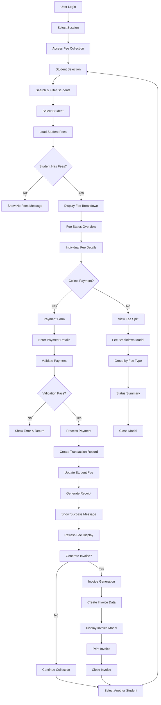

# 🔄 Fee Collection Workflow Diagram

## 📊 **Complete System Flow**



## 🎯 **Key Decision Points**

### **1. Student Selection Phase**
```
┌─────────────────┐    ┌─────────────────┐    ┌─────────────────┐
│   Search Input  │───▶│  Apply Filters  │───▶│  Select Student │
└─────────────────┘    └─────────────────┘    └─────────────────┘
         │                       │                       │
         ▼                       ▼                       ▼
┌─────────────────┐    ┌─────────────────┐    ┌─────────────────┐
│  Name/Admission │    │ Class/Section   │    │  Visual Cards   │
│     Search      │    │   Filtering     │    │   Selection     │
└─────────────────┘    └─────────────────┘    └─────────────────┘
```

### **2. Fee Management Phase**
```
┌─────────────────┐    ┌─────────────────┐    ┌─────────────────┐
│  Load Student   │───▶│  Display Fee    │───▶│  Payment        │
│     Fees        │    │   Breakdown     │    │  Collection     │
└─────────────────┘    └─────────────────┘    └─────────────────┘
         │                       │                       │
         ▼                       ▼                       ▼
┌─────────────────┐    ┌─────────────────┐    ┌─────────────────┐
│  API Call to    │    │  Get Fees       │    │  Status Cards   │
│  Get Fees       │    │  Progress Bars  │    │  Progress Bars  │
└─────────────────┘    └─────────────────┘    └─────────────────┘
```

### **3. Payment Processing Phase**
```
┌─────────────────┐    ┌─────────────────┐    ┌─────────────────┐
│  Payment Form   │───▶│  Validation     │───▶│  API Call       │
│   Submission    │    │   Check         │    │  to Backend     │
└─────────────────┘    └─────────────────┘    └─────────────────┘
         │                       │                       │
         ▼                       ▼                       ▼
┌─────────────────┐    ┌─────────────────┐    ┌─────────────────┐
│  Amount, Date,  │    │  Business Rules │    │  Database       │
│  Mode, Notes    │    │  Enforcement    │    │  Transaction    │
└─────────────────┘    └─────────────────┘    └─────────────────┘
```

### **4. Post-Payment Phase**
```
┌─────────────────┐    ┌─────────────────┐    ┌─────────────────┐
│  Transaction    │───▶│  Update UI      │───▶│  Generate       │
│   Success       │    │   Display       │    │   Invoice       │
└─────────────────┘    └─────────────────┘    └─────────────────┘
         │                       │                       │
         ▼                       ▼                       ▼
┌─────────────────┐    ┌─────────────────┐    ┌─────────────────┐
│  Receipt No     │    │  Fee Status     │    │  Invoice Modal  │
│  Generation     │    │   Refresh       │    │   Display       │
└─────────────────┘    └─────────────────┘    └─────────────────┘
```

## 🔄 **Session & Role Integration Points**

### **Session Management**
```
┌─────────────────┐    ┌─────────────────┐    ┌─────────────────┐
│  Current        │───▶│  API Requests   │───▶│  Database       │
│  Session        │    │  Include        │    │  Queries        │
└─────────────────┘    └─────────────────┘    └─────────────────┘
         │                       │                       │
         ▼                       ▼                       ▼
┌─────────────────┐    ┌─────────────────┐    ┌─────────────────┐
│  Session ID     │    │  Session        │    │  Filter by      │
│  Context        │    │  Parameter      │    │  Session        │
└─────────────────┘    └─────────────────┘    └─────────────────┘
```

### **Role-Based Access Control**
```
┌─────────────────┐    ┌─────────────────┐    ┌─────────────────┐
│  User Role      │───▶│  Permission     │───▶│  Feature        │
│  Check          │    │   Validation    │    │   Access        │
└─────────────────┘    └─────────────────┘    └─────────────────┘
         │                       │                       │
         ▼                       ▼                       ▼
┌─────────────────┐    ┌─────────────────┐    ┌─────────────────┐
│  Admin/         │    │  Backend        │    │  UI Elements    │
│  Accountant     │    │  Middleware     │    │   Show/Hide     │
└─────────────────┘    └─────────────────┘    └─────────────────┘
```

## 📱 **User Interface Flow**

### **Main Dashboard Flow**
```
┌─────────────────┐    ┌─────────────────┐    ┌─────────────────┐
│  Header with    │───▶│  Student        │───▶│  Fee            │
│  Session Info   │    │  Selection      │    │  Management     │
└─────────────────┘    └─────────────────┘    └─────────────────┘
         │                       │                       │
         ▼                       ▼                       ▼
┌─────────────────┐    ┌─────────────────┐    ┌─────────────────┐
│  Action Buttons │    │  Search &       │    │  Fee Cards      │
│  (Breakdown,    │    │  Filter Panel   │    │  with Actions   │
│   Invoice)      │    │                 │    │                 │
└─────────────────┘    └─────────────────┘    └─────────────────┘
```

### **Modal Flow Management**
```
┌─────────────────┐    ┌─────────────────┐    ┌─────────────────┐
│  Modal Trigger  │───▶│  Modal Open     │───▶│  Modal Content  │
│  (Button Click) │    │  (State Change) │    │   Display       │
└─────────────────┘    └─────────────────┘    └─────────────────┘
         │                       │                       │
         ▼                       ▼                       ▼
┌─────────────────┐    ┌─────────────────┐    ┌─────────────────┐
│  Event Handler  │    │  Backdrop       │    │  Close Button   │
│  Function       │    │  & Animation    │    │   & Actions     │
└─────────────────┘    └─────────────────┘    └─────────────────┘
```

## 🔄 **Error Handling Flow**

### **Validation Error Flow**
```
┌─────────────────┐    ┌─────────────────┐    ┌─────────────────┐
│  Form           │───▶│  Validation     │───▶│  Error          │
│  Submission     │    │   Check         │    │   Display       │
└─────────────────┘    └─────────────────┘    └─────────────────┘
         │                       │                       │
         ▼                       ▼                       ▼
┌─────────────────┐    ┌─────────────────┐    ┌─────────────────┘
│  Input Data     │    │  Business Rules │    │  Toast          │
│  Collection     │    │   Validation    │    │  Notification   │
└─────────────────┘    └─────────────────┘    └─────────────────┘
```

### **API Error Flow**
```
┌─────────────────┐    ┌─────────────────┐    ┌─────────────────┐
│  API Call       │───▶│  Error          │───▶│  Error          │
│  Execution      │    │   Response      │    │   Handling      │
└─────────────────┘    └─────────────────┘    └─────────────────┘
         │                       │                       │
         ▼                       ▼                       ▼
┌─────────────────┐    ┌─────────────────┐    ┌─────────────────┘
│  Network        │    │  HTTP Status    │    │  User           │
│  Request        │    │   Codes         │    │  Notification   │
└─────────────────┘    └─────────────────┘    └─────────────────┘
```

## 📊 **Data State Management**

### **Component State Flow**
```
┌─────────────────┐    ┌─────────────────┐    ┌─────────────────┐
│  Initial State  │───▶│  State Update   │───▶│  Re-render      │
│  Setup          │    │  (API Response) │    │   Component     │
└─────────────────┘    └─────────────────┘    └─────────────────┘
         │                       │                       │
         ▼                       ▼                       ▼
┌─────────────────┐    ┌─────────────────┐    ┌─────────────────┘
│  useState       │    │  setState       │    │  React          │
│  Hooks          │    │   Functions     │    │  Reconciliation │
└─────────────────┘    └─────────────────┘    └─────────────────┘
```

### **API State Management**
```
┌─────────────────┐    ┌─────────────────┐    ┌─────────────────┐
│  Loading State  │───▶│  Success State  │───▶│  Error State    │
│  (Spinner)      │    │  (Data Display) │    │  (Error Msg)    │
└─────────────────┘    └─────────────────┘    └─────────────────┘
         │                       │                       │
         ▼                       ▼                       ▼
┌─────────────────┐    ┌─────────────────┐    ┌─────────────────┘
│  API Call       │    │  Data           │    │  Error          │
│  Initiated      │    │   Processing    │    │   Handling      │
└─────────────────┘    └─────────────────┘    └─────────────────┘
```

## 🎯 **Key Success Metrics**

### **User Experience Metrics**
- **Task Completion Rate**: % of successful fee collections
- **Time to Complete**: Average time for fee collection
- **Error Rate**: % of failed operations
- **User Satisfaction**: Feedback scores

### **System Performance Metrics**
- **API Response Time**: Average response time
- **Database Query Time**: Query execution time
- **Memory Usage**: Frontend memory consumption
- **Error Handling**: Error resolution time

## 🔧 **Technical Implementation Notes**

### **State Management Strategy**
- **Local State**: Component-level state for UI interactions
- **Shared State**: Context-based state for session and user data
- **Server State**: API response caching and synchronization

### **Performance Optimization**
- **Lazy Loading**: Components load on demand
- **Memoization**: Expensive calculations cached
- **Debouncing**: Search input optimization
- **Pagination**: Large dataset handling

### **Security Considerations**
- **Input Validation**: Client and server-side validation
- **Authentication**: Token-based access control
- **Authorization**: Role-based feature access
- **Data Sanitization**: XSS and injection prevention
